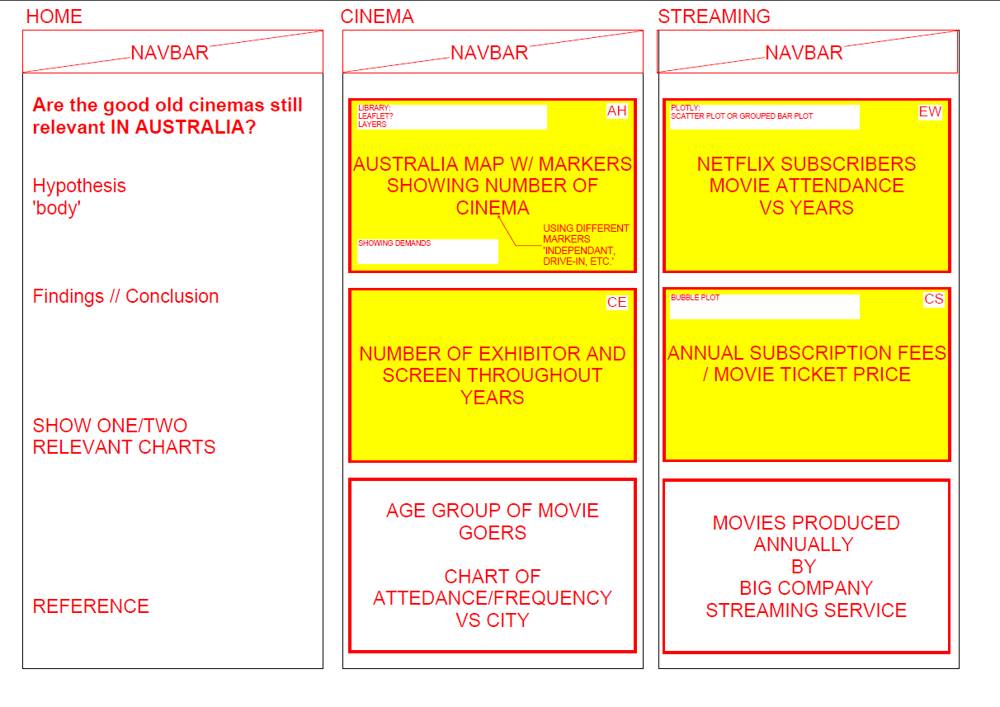

# Cinema-vs-Streaming Services - Project2 

## Team
* Carmen Sin
* Camille Evangelista
* Edbert Widjaja
* Aline Hornoff

## Overview:
Are the good old cinemas still relevant in Australia today?

In times of instant online entertainment availability through streaming services, covid and social distancing are the good all traditional brick and mortar cinemas still relevant? Who attends cinemas and who uses streaming services? What value does a cinema goer get for their money compared to paying for a streaming service? 

This project is looking at ....

## Data Sources
* Netflix Data: https://ir.netflix.net/financials/quarterly-earnings/default.aspx
* Screen Australia: https://www.screenaustralia.gov.au/fact-finders/cinema/audiences/attendance-patterns
* Movie Ratings: https://blog.api.rakuten.net/top-10-best-movie-apis-imdb-movie-database-unogs/
* Movie Guide: https://www.movieguide.org/news-articles/who-goes-to-the-movies-4.html#:~:text=The%20Motion%20Picture%20Association%20of,the%20movies%20at%20least%20once.
* Netflix statistics: https://www.businessofapps.com/data/netflix-statistics/
* Australian Bureau of Statistics: https://www.abs.gov.au/AUSSTATS/abs@.nsf/Lookup/4102.0Main+Features40Jun+2011
* https://takeatumble.com.au/insights/lifestyle/video-streaming-in-australia-statistics/

## Data Story

## Visualisation
* Interactive Australia map with Markers showing number of different cinemas - Aline
* Bubble plot - Annual Subscription fees / movie ticket price - Carmen
* ... - Number of exhibitor and screen throughout years - Camille
* Grouped bar plot - Netflix subscribers movie attendance vs years - Edbert

## Task and timeframe
* Gather and clean up data
* Create database
* Create Visualisations
* Create HTML/CSS
* Create presentation

