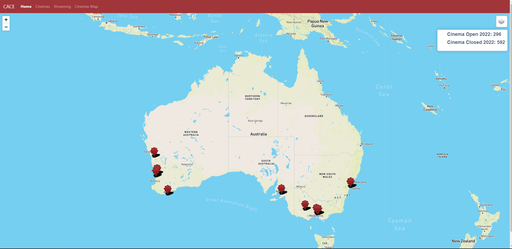

# Cinema-vs-Streaming Services - Project2 

## Team
* Carmen Sin
* Camille Evangelista
* Edbert Widjaja
* Aline Hornoff

## Overview:
Back in the day if people wanted to watch the latest movie everyone else was talking about, they go to the cinema with their family or friends. In case they did not make it on the movie schedule, they had to wait for it to be available in their nearest video rental shop.

Nowadays due to technological advancement we have the option to use streaming services in the comfort of our own homes to watch movies. This option gained more popularity when Covid happened as most people chose to stay home and also restrictions were put in place on public spaces. This made us ask the question, are cinemas still relevant?

## Data Sources
* Netflix Data: https://ir.netflix.net/financials/quarterly-earnings/default.aspx
* Screen Australia: https://www.screenaustralia.gov.au/fact-finders/cinema/audiences/attendance-patterns
* Movie Ratings: https://blog.api.rakuten.net/top-10-best-movie-apis-imdb-movie-database-unogs/
* Movie Guide: https://www.movieguide.org/news-articles/who-goes-to-the-movies-4.html#:~:text=The%20Motion%20Picture%20Association%20of,the%20movies%20at%20least%20once.
* Netflix statistics: https://www.businessofapps.com/data/netflix-statistics/
* Australian Bureau of Statistics: https://www.abs.gov.au/AUSSTATS/abs@.nsf/Lookup/4102.0Main+Features40Jun+2011
* https://takeatumble.com.au/insights/lifestyle/video-streaming-in-australia-statistics/
* Cinema Treasures: http://cinematreasures.org/theaters/australia?status=all

## Data Story

## Visualisation
* Interactive Australia map with Markers showing number of different cinemas - Aline
* Bubble plot - Annual Subscription fees / movie ticket price - Carmen
* ... - Number of exhibitor and screen throughout years - Camille
* Grouped bar plot - Netflix subscribers movie attendance vs years - Edbert

## Task and timeframe
* Gather and clean up data
* Create database
* Create Visualisations
* Create HTML/CSS
* Create presentation

## Conclusion
It seems that the streaming services did not have much effect on people's preference on going to movies. Data shows that cinemas available and movie-goers have been steady until Covid happened. The pandemic is the main factor that affected the number of cinemas being open and people attending due to the protocols and restrictions put in place by the government.

With the easing of restrictions, the numbers have gone up compared to 2020 however due to the uncertainty we have with further effects of Covid, we cannot confirm if it would continuously go up the same level as pre-Covid.

## Output
Home

Cinemas

The graph shows a drop of 18% in the number of theatres between 1984 and 1985 however the number of screens continuously went up. According to ScreenAustralia, this is due to industry transitioning from single screens to multiplexes.

Streaming

According Screen Australia, the average cinema ticket price was $15.24 in 2021. There are plenty of fee for streaming platforms to compete for the eyeball. This chart compares the streaming provider's fee and their number of simultanceous streams. In terms of pricing, cinema ticket price is definitely competitive and not the reason cinema-goers goers will be detered by. The restriction and health protocool does excelerate the adoption of signing up streaming services while we cannot phyiscally go to cinema. Online streaming offerings and Cinemas are not muturally exclusive options. Whilst online streaming does introduce competition, but it can never replace the cinema experience. Consumers utlimatly have the benefit of choosing their interested content and make switches whenever they want.

We asked the question - How do boxoffice movie releases compare to how often people attend the cinema per person per year and how does the number of subscribers to streaming services compare to that? The graph indicates a steady release of boxoffice movies until 2020 when Covid hit with between 800 and 1000 releases per year. Up until 2020 the frequency of how often people would go to the movies amounted to between 6-7 times per year. There was a sharp decline in 2020 due to Covid restictions and temporary shut downs due to social distancing measures. Streaming services entered the stage in 2017 since then the number of streaming service subscribers has exploded to over 30 million subscribers.

Cinemas Map

The cinemas Map is an interactive map where the user can take a look at cinema locations all over Australia that are currently open. Utilising the legend on the top hand right corner the user can also have a look at cinema locations that have been closed over time. The user can have all open and closed cinemas showing or choose to display one or the other. The counter indicates that a total of 296 are currently open, where as a total of 592 cinemas have been closed over time. 

